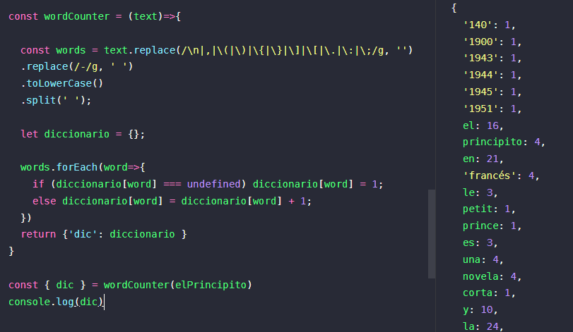

# Contar palabras de un texto [🐾](../main.md)

Hay que crea una función que tome una cadena texto la procese y cuente cada una de las palabras, hay que tratar de que las palabras no se repitan al contarlas y idealmente tratando de que la función este lo mas optimizada posible, si se usa un bucle tratar de que no escale de manera logarítmica anidando.

```javascript
const wordCounter = (text)=>{
  // limpio los caracteres => \n () {} [] . , : ; ' "
  // reemplazo - por espacios 
  // transformo todo a lowercase
  // y genero un array con las palabras
  const words = text.replace(/\n|,|\(|\)|\{|\}|\]|\[|\.|\:|\;|\'|\"/g, '')
  .replace(/-/g, ' ')
  .toLowerCase()
  .split(' ');
  
  let diccionario = {};
  
  // Genero un diccionario con un objeto
  // con Key=palabra y valor=numero_de_repeticiones
  // iterando solo una vez la lista de palabras
  words.forEach(word=>{
    if (diccionario[word] === undefined) diccionario[word] = 1;
    else diccionario[word] = diccionario[word] + 1;
  })

  return {'dic': diccionario }
}

const elPrincipito = `Texto de "El principito" de Wikipedia`

const { dic } = wordCounter(elPrincipito)
console.log(dic)

```

